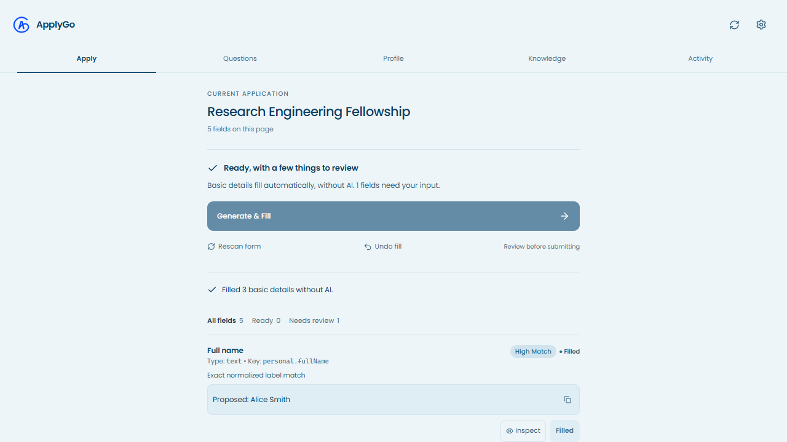

# ApplyGo

### No pay. No pain. Just apply.

ApplyGo is a local-first Chrome extension that fills the details you already know and helps write the answers that take longer. Jobs, fellowships, events, research programs, scholarships: less copying the same information, more time on the application itself.



*Actual extension UI, captured at 1280 × 720 with fictional candidate data. This is the side-panel interface opened in a browser tab for the screenshot.*

## How it works

There are two separate stages:

1. **Fill the facts locally.** Open a form and launch ApplyGo. It scans the page, reads labels, and fills high-confidence basic details from your saved profile and imported knowledge base. Names, email, LinkedIn, GitHub, education, and other supported structured fields do not need AI or an API key.
2. **Generate the written answers when you're ready.** Click **Generate & Fill** to draft responses using your configured provider and allowed knowledge entries. The form engine inserts eligible answers sequentially; uncertain answers and missing facts stay available for review.

Your final review and submission are always yours. ApplyGo does not submit applications, solve CAPTCHAs, or invent missing personal information. It preserves existing answers rather than overwriting them by default.

## Features

- Import a Markdown knowledge base and extract supported profile facts, including bold labels, lists, links, and tables.
- Local contact autofill, independent of AI availability.
- A logo-only floating launcher and five side-panel tabs: Apply, Questions, Profile, Knowledge, Activity.
- Grounded written drafts with source references, missing-information reporting, and review states.
- Bring your own API key: Gemini, OpenAI, OpenRouter, Ollama, or another supported OpenAI-compatible endpoint.
- Editable drafts, local application history, fill verification, and undo for supported fill transactions.
- Store PDF/DOCX resumes and attempt attachment to supported native file controls. Custom upload widgets may still need a manual upload.
- Export and restore local JSON backups.
- Ocean colors and locally bundled Poppins fonts.

**About “No pay”:** ApplyGo does not impose an application subscription or paywall. Your AI provider may charge for requests or enforce quotas. Basic autofill does not use the provider. This repository does not promise free API access.

## Install from source

Use a current Node.js LTS release, npm, and Google Chrome with the Side Panel API. Other Chromium browsers may differ; they are not all verified.

```sh
git clone https://github.com/daudibrahimhasan/ApplyGo.git
cd ApplyGo
npm ci
npm run build
```

Then:

1. Open `chrome://extensions`.
2. Enable **Developer mode**.
3. Select **Load unpacked** and choose the repository's `dist` folder.
4. Pin ApplyGo, open an application form, and click the toolbar icon or floating logo.

After rebuilding, reload the extension and refresh the form page. Old injected buttons keep their old extension connection until the page reloads.

## Set up your information

1. Open **Knowledge → Import .md** and import your own document. A fictional format example is available in [sample-knowledge.md](tests/fixtures/sample-knowledge.md).
2. Check **Profile**. Supported explicit facts can be extracted from the knowledge base, but information that is missing, ambiguous, or unsupported needs to be added manually. Save your profile.
3. Add a resume in **Profile** if you want it available for supported upload fields.
4. For written responses, open **Settings**, select a provider, enter your key, choose a model your account actually supports, and test the connection.
5. Open a form. Basic details fill locally. Use **Generate & Fill** for written answers, inspect review fields, and submit manually.

The writing prompt currently includes the author's conversational writing style. If you're adapting ApplyGo for yourself, review [systemPrompt.ts](src/core/generation/systemPrompt.ts) and replace those voice instructions with your own. The extension starts with an empty profile and knowledge base, not the author's personal information.

## Compatibility and limits

The engine detects native inputs, textareas, selects, accessible custom controls, and editable textboxes. It reads native labels, ARIA references, question headings, and nearby instructions, including Google Forms-style layouts. Dynamic pages are rescanned as fields change.

Platform recognition exists for Google Forms and several application systems, including Greenhouse, Lever, Ashby, Workable, SmartRecruiters, Fillout, Typeform, and Workday. **Recognition is not a guarantee of successful filling on every platform.** The automated tests use local fixtures, not a comprehensive live compatibility matrix.

- Custom dropdowns, multi-step flows, inaccessible frames, and closed shadow roots can need manual help.
- Only currently accessible page controls can be scanned; future pages are not magically available.
- Canvas-rendered controls cannot be read as normal form fields.
- Browser system pages such as `chrome://newtab` cannot be inspected.
- Sensitive fields and legal consent require manual handling.
- API errors, model access restrictions, quotas, and provider outages can prevent writing generation. They should not block local basic autofill.
- A matched field with no saved value stays blank. Check Profile before assuming the detector is broken.

## Privacy and permissions

Profile facts, knowledge entries, resume data, settings, and history are stored locally in the browser extension. There is no application backend or telemetry in this codebase.

When you request AI writing, the configured provider receives the prompt and supplied grounding context. Depending on the workflow, this includes question/opportunity text and profile or knowledge information. Local-first does **not** mean those AI requests stay on your device. Review your provider's policies and knowledge-entry AI permissions.

The API key is stored in extension storage and used by the background service worker. Extension storage is not a hardware-backed secret vault. Exported backups may contain sensitive information; keep them private. Do not commit your personal knowledge base, keys, resumes, or browser profiles.

| Permission | Why it is used |
| --- | --- |
| `activeTab`, `tabs` | Identify and interact with the application tab. |
| `scripting` | Inject the scanning and filling engine. |
| `storage` | Save your local information and settings. |
| `sidePanel` | Show the extension interface alongside a form. |
| HTTP/HTTPS host access | Read supported forms and communicate with configured provider endpoints. |

Broad host access is declared in the manifest. Review [manifest.config.ts](manifest.config.ts) before installing if that does not fit your privacy requirements.

## Development

Built with React, TypeScript, Vite, Manifest V3, Zod, Vitest, and Playwright.

```sh
npm run dev                         # Development build
npm test                            # Unit and integration tests
npx playwright install chromium     # Install the browser used by tests
npm run test:e2e                     # Extension browser tests
npm run lint                        # Code checks
npm run package                     # Build and verify the unpacked bundle
node scripts/capture-ui.js          # Recreate the 16:9 README screenshot after building
```

`npm run package` verifies `dist`; it does not publish to the Chrome Web Store or create a release automatically.

```text
src/background/    Provider requests and extension messaging
src/content/       Detection, field interaction, launcher, and platform recognition
src/core/          Matching, Markdown import, retrieval, validation, and writing rules
src/shared/        Schemas, storage, contracts, and provider settings
src/sidepanel/     Main application interface
src/options/       Standalone settings page
tests/             Unit, integration, and Chromium extension tests
```

## Contributing

See [CONTRIBUTING.md](CONTRIBUTING.md) for setup, bug reports, test requirements, and the privacy and safety boundaries. Contributions that improve real form compatibility are welcome. Include a minimal non-private fixture or reproducible example, and test both detection and the actual inserted value. Do not submit real applications as part of testing.
